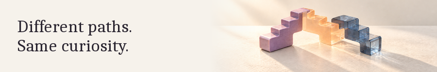

<picture><source media="(prefers-color-scheme: dark)" srcset="assets/2-paths-dark.png"><source media="(prefers-color-scheme: light)" srcset="assets/1-paths-light.png"></picture>

[Portfolio](https://manavdev.site/) · [gg buddy](https://gg-buddy.vercel.app/) · [Toolpaper](https://toolpaper.vercel.app/) · [X: @ManavShips](https://x.com/ManavShips)

I build across learning tools, developer tools, and browser-based experiments. Different ideas, the same curiosity: make something useful, then keep improving it.

## Selected work

### gg buddy · Learning
A visual Git course with beginner lessons and a practice terminal. Application source stays private.

[Explore the course](https://gg-buddy.vercel.app/)

### Toolpaper · Developer tools
Turn cURL commands into request code for 18 language and library targets, with request cleanup and explanations. Code generation runs in the browser; source stays private.

[Open Toolpaper](https://toolpaper.vercel.app/)

### PrepTracker · Study tools
An academic dashboard for syllabus progress, resources, and tasks. Progress is saved in your browser; the site also includes Google Analytics.

[Try PrepTracker](https://manav4u.github.io/PrepTracker/) · [Read the source](https://github.com/manav4u/PrepTracker)

## How I work
I use AI-assisted workflows to build and refine browser-based interfaces. The links above show what I've made so far, not the limits of what I'll build next.

## One commit at a time

<picture>
  <source media="(prefers-color-scheme: dark)" srcset="https://raw.githubusercontent.com/manav4u/manav4u/output/contribution-snake-dark.svg">
  <source media="(prefers-color-scheme: light)" srcset="https://raw.githubusercontent.com/manav4u/manav4u/output/contribution-snake-light.svg">
  
</picture>

Generated daily by GitHub Actions.
