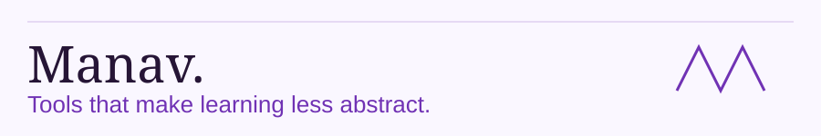

<picture><source media="(prefers-color-scheme: dark)" srcset="assets/profile-header-dark.svg"><source media="(prefers-color-scheme: light)" srcset="assets/profile-header-light.svg"></picture>

[Portfolio](https://manavdev.site/) · [gg buddy](https://gg-buddy.vercel.app/) · [PrepTracker source](https://github.com/manav4u/PrepTracker) · [X: @ManavShips](https://x.com/ManavShips)

I build tools that make learning less abstract: visual Git lessons, study tools, and experiments with AI-assisted development.

## Selected work

### gg buddy

A visual Git course with beginner lessons and a practice terminal. Try the live course to see the interface and learning approach. Application source stays private.

**Built with:** Astro · JavaScript · CSS · Vercel

[Explore the course](https://gg-buddy.vercel.app/)

### PrepTracker

An academic dashboard for syllabus progress, study resources, and tasks. Study progress and tasks are saved in your browser. The site also includes Google Analytics; local storage does not mean no tracking.

**Built with:** React 19 · TypeScript · Tailwind CSS · Vite · React Router 7

[Try PrepTracker](https://manav4u.github.io/PrepTracker/) · [Read the source](https://github.com/manav4u/PrepTracker)

## How I work

I use AI-assisted workflows to build browser-based interfaces. The project links above show the work, and PrepTracker's public repository lets you inspect its implementation.

## One commit at a time

<picture>
  <source media="(prefers-color-scheme: dark)" srcset="https://raw.githubusercontent.com/manav4u/manav4u/output/contribution-snake-dark.svg">
  <source media="(prefers-color-scheme: light)" srcset="https://raw.githubusercontent.com/manav4u/manav4u/output/contribution-snake-light.svg">
  
</picture>

Generated daily by GitHub Actions.
