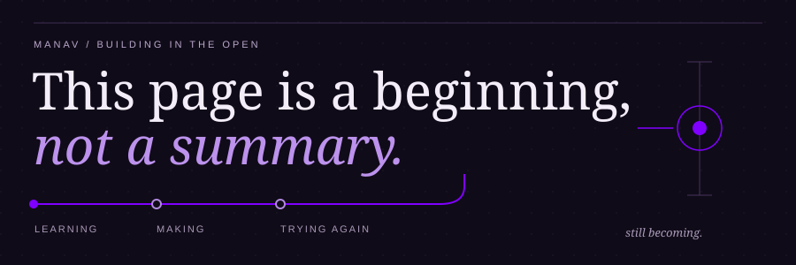
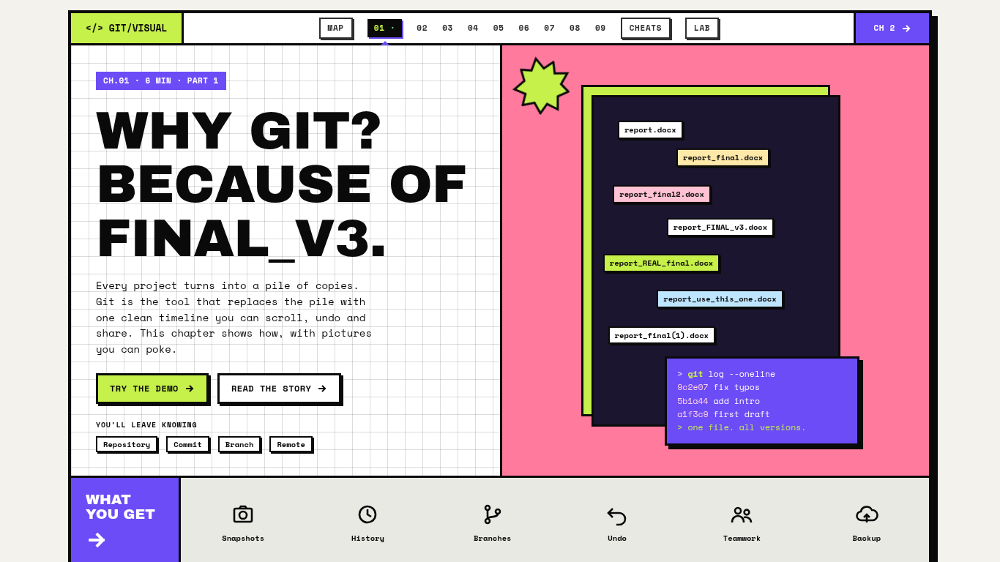
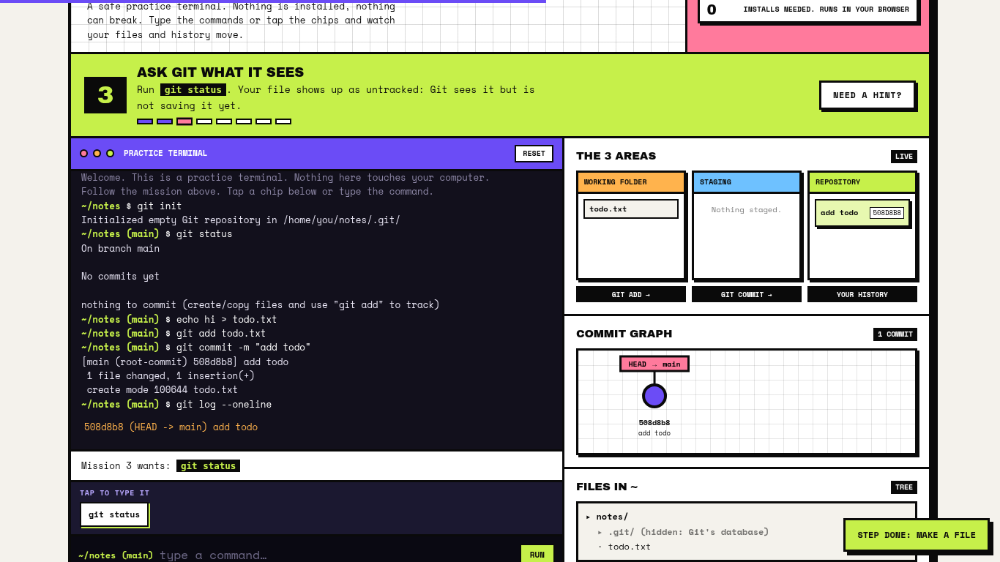
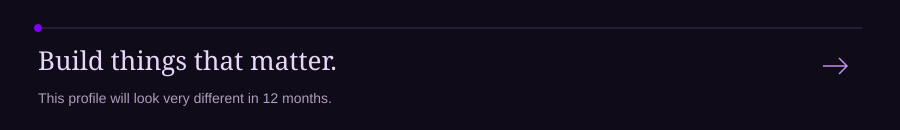

<picture>
  
</picture>

  
  
  

I build things that make learning less abstract. Right now, that means a visual Git course, an academic tracker, and experiments with AI-assisted development.

## Selected work

### 01 / gg buddy

**Learn Git by seeing it happen.**

Nine beginner chapters. Visual explanations, clickable installer replicas, and a practice terminal for trying commands without risking a real repository.

- **Practice, don't just read.** A simulated Git lab and a searchable 247-command cheat sheet.
- **Pick up where you left off.** Saved chapter progress and a copy-progress-link feature for carrying it to another device.
- **Keep learning offline.** An installable PWA with cached course pages.

**Built with:** Astro · JavaScript · CSS · Vercel

[Explore the course →](https://gg-buddy.vercel.app/)

Inside the practice lab

 

 
A safe place to get the mental model right before using Git on your own files. It's a simulation, not a hosted shell.

### 02 / PrepTracker

**A little less chaos before the exam.**

An academic dashboard for syllabus progress, study resources, and tasks. Progress is stored locally in the browser.

**Built with:** React · TypeScript · Tailwind CSS · Vite

[Read the source →](https://github.com/manav4u/PrepTracker)

## A smaller, honest stack

| | What belongs here |
| :--- | :--- |
| **Current work** | Git, GitHub, browser-based interfaces |
| **Built with** | Astro, React, TypeScript, JavaScript, CSS, Tailwind CSS, Vite, Vercel |
| **Exploring** | AI-assisted workflows and product building |

Tools are context, not trophies. The projects above show where I've used them.

## One commit at a time

<picture>
  <source media="(prefers-color-scheme: dark)" srcset="https://raw.githubusercontent.com/manav4u/manav4u/output/contribution-snake-dark.svg">
  <source media="(prefers-color-scheme: light)" srcset="https://raw.githubusercontent.com/manav4u/manav4u/output/contribution-snake-light.svg">
  
</picture>

My contribution graph, with a snake doing the cleanup. Generated daily by GitHub Actions.

## Beyond the repos

I'm also testing viral tech claims and sharing what holds up on [X, @ManavShips](https://x.com/ManavShips).

